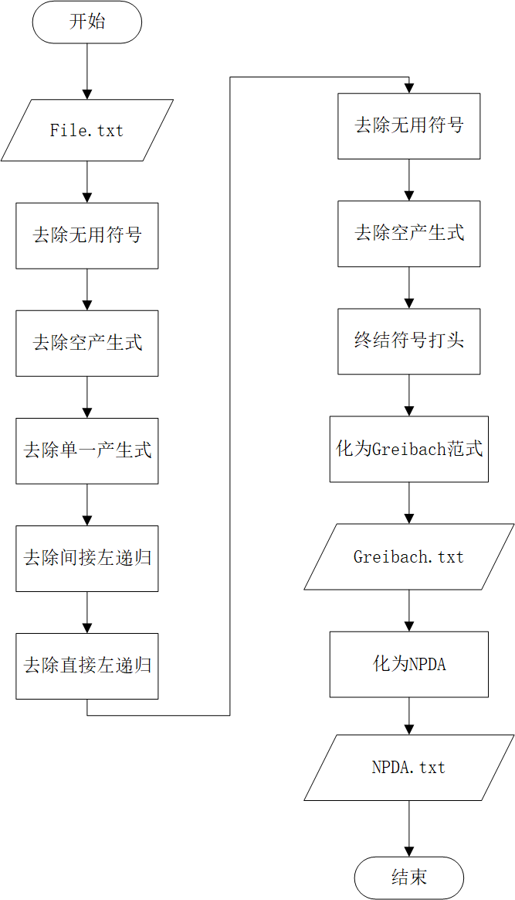
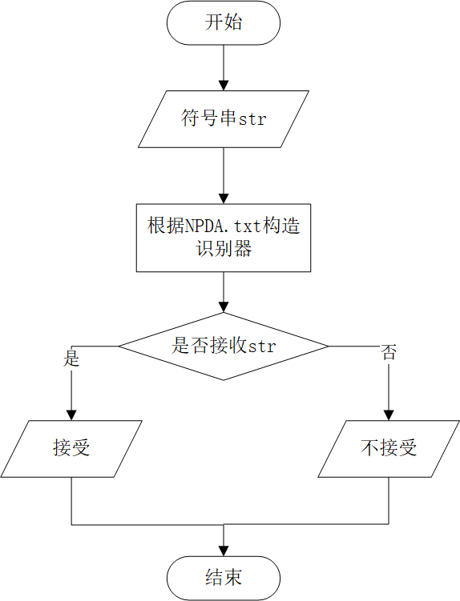

# Formal_langurage-Automata

### 数据存储结构

二型文法存储在File.txt中

```python
V = {S, Q, R}
T = {a, b, c}
P = {S->Qc|c, Q->Rb|b, R->Sa|a}
S = {S}

```

文件读入后，V、T、S用列表存储，P用字典P_dict存储，其中key为非终结符集合，value由产生式右部组成的列表

```python
V: ['S', 'Q', 'R']
T: ['a', 'b', 'c']
S: ['S']
P_dict = ['S': ['Qc', 'c'], 'Q': ['Rb', 'b'], 'R': ['Sa', 'a']]
```

### 算法整体流程





### 各部分算法介绍

#### 去除无用符号

1、计算“产生的”符号集N（每个T中的符号都是产生的，若A->a且a中的符号都是产生的，则A是产生的）

```python
for i in range(len(V)):							#遍历所有的V
	for j in range(len(V_temp)):				#遍历所有的V_temp，V_temp是V的拷贝
		if(P中存在V[i]->a且a中所有符号都属于N):
			将V[j]从V_temp中删除并加入到N中，同时跳出内层循环
```

2、计算“可达的”符号集M（开始符号S是可达的，若A->a且A是可达的，则a中所有符号都是可达的）

```python
def Reach(S):
	visited[S] = True							#标记S已访问
	for right in P_dict[S]:						#遍历所有的S->a
		将right中所有符号加入到M中			     #right为S产生式的右部
		if (right中存在符号A and A为非终结符 and !visited[A]):
			Reach(A)
```

3、计算无用符号集合NM，消除P中含有NM的式子

```python
for i in Q:
    if (i in N and i in M):
        continue
    else:
        NM.append(i)			#不可产生或者不可达
遍历所有产生式，删除含有NM的式子，更新P_dict、V、T
```

#### 去除ε产生式

1、计算集合V0，V0 = ｛A属于V且A经过有限步骤能推出ε｝

```python
for i in V:
	for j in V:
        if (左部为j的产生式右部所有符号都在V0中):			#V0初始为{ε}
            将j加入到V0中，同时跳出内层循环
```

2、消除ε产生式

```python
for key, values in P_dic.items():
    if (存在产生式A->a0A1a1A2...ak-1Ak-1ak,其中aj属于(V∪T)*,Ai属于V0):
        将Ai以Ai本身或者空替代，将新形成的产生式扣除ε加入到P_dict_new中
    elif (产生式的左部属于V0)：
    	将ε产生式扣除加入到P_dict_new中
    if(存在S->ε):
        引入S'->S|ε，S'为新的开始符号
更新P_dict、V
```

#### 去除单一产生式

算法整体思想：遍历所有产生式，若该产生式非单一产生式，则直接加入到新的产生式字典中；若该产生式是单一产生式，如S->Q，则递归查询Q替换的右部

```python
for key, values in P_dict.items():					#遍历所有的产生式字典
    for value in values:				   			#遍历V[key]产生式的每一个右部
        if (value not in V):						#非单一产生式
            将该产生式加入到P_dict_new中
        else:										#单一产生式
            right_new = replace (P_dict, value, V)  #调用replace函数返回value替换的新的右部
            将新的右部加入到P_dict_new[[key]中
```

replace()函数用于递归返回一个非终结符的去除单一产生式后的所有产生式

```python
def replace(P_dict, B, V):
    temp_list = []									#存放非终结符B的所有非单一产生式
    for right in P_dict[B]:							#遍历关于B的所有产生式右部
        if (right not in V):						#该产生式非单一产生式
            temp_list.append(right)					#直接加入到temp_list中
        else:										#该产生式为单一产生式
            new_right = replace(P_dict, right, V)	#返回该非终结符的所有非单一产生式
            for i in new_right:						#依次加入到temp_list中
                temp_list.append(i)
    return temp_list
```

#### 去除间接左递归

间接左递归形如 S->Qc，Q->Rb，R->Sa

1、将所有的非终结符进行编号，若非终结符V1的某一产生式的右部最左符号为非终结符V2，且V2的序号小于V1，则用V2的右部替换该产生式中的V2

```python
for i in range(len(V)):
    for j in range(0,i):
        遍历所有V[i]产生式
        	if (V[i]产生式右部最左符号 == V[j]):
                用V[j]的右部替换该符号
```

此时，所有间接左递归转化为直接左递归，如S->Qc，Q->Rb，R->Rbca

#### 去除直接左递归

直接左递归形如 A->Aa|Ab|ab|c

1、引入A+，将上式改为A->abA+|cA+，A+->aA+|bA+|ε

```python
遍历所有产生式
if (该产生式左部符号与右部最左符号V相同)：
	判断所有关于V的产生式，将所有不含直接左递归的右部加入list1中，将含有直接左递归的右部加入list2中，
    如在上述例子中list1 = [ab, c]，list2 = [a, b]
    将引入的A+加入到非终结符集V中
    for i in list1:
        构造关于V的新产生式，V->iV+
    for i in list2:
        构造新的产生式V+->iV+|ε
```

#### 以终结符号打头

化为Greibach前要将所有产生式的右部化为以终结符号打头

算法思想：遍历所有产生式，若存在产生式形如P->Aac以非终结符打头的产生式，则用A的右部替换P->Aac中的A，若替换后还存在非终结符打头，则继续替换，直到全部以非终结符打头为止

#### 化为Greibach范式

对于每一个产生式，针对右部终结符（不是打头的）a，引入新的非终结符A\*，将a换为A*，并加入构造新的产生式A\*->a。

例如A->aBabc，改造为A->aBA\*B\*C\*，构造新的产生式A\*->a，B\*->b，C\*->c

#### Greibach化为NPDA

非确定型下推自动机定义为一个七元组 M = (Q, Σ, Γ, δ, q0, z, F)

其中，Q :  是控制部件内部状态有有穷集

​			Σ ：输入字母表

​			Γ :   是一个有穷符号集，称为栈字母表

​			δ :   转移函数，参数为(q, a, A)其中q为当前状态，a为输入字符，A为栈顶符号

​			q0 : 控制部件的初始状态

​			z :    栈的开始符号

​			F :    终止状态集合

NPDA的当前状态，输入符号和当前栈顶符号决定自动机转换。转移函数δ列出所有给定状态、输入符号和栈顶元素所有可能的转换。如：

δ(q,a,A)={(p1,ω_1 ), (p2,ω_2 ),⋯,(pn,ωn )}

表示当前状态q,输入符号a,栈顶符号A时的n种可能的转换

Greibach化为NPDA方法：

Q = {q0，q1，q2}

Σ = V

Γ = T

q0 = q0

z = z

F = q2

初始状态构造 δ(q0, ε, z) = {(q1, Sz)}，终止状态构造 δ(q1, ε, z) = {(q2, z)}

对于每一个产生式，eg. S->aAB|bAC，则构造 δ(q1, a, S) = {(q1, AB), (q1, AC)}

#### NPDA接受语言

1、准备工作

```python
input_now = 'ε'				#指向当前输入字符，初始为ε 
stack = []					#列表模拟下推栈
stack.append(z)				#开始符号入栈，z为设定的栈的开始符号
q_now = q0					#q_now为当前状态， 𝑞0 为初始状态
stack_top = z				#栈顶符号，初始为z
Deta_now = ''				#当前的转移函数字符串，格式为‘当前状态，输入符号，栈顶符号’
```

2、构造识别器

```python
while (q_now != F):
	Delta_now = q_now + ',' + input_now + ',' + stack_top		#更新Delta_now
    if (存在转移函数𝛿={(p1,w1)}与Delta_now匹配)：
    	stack.pop(len(stack)-1)									#栈顶元素出栈
        将w1中的字符依次入栈（如w为ABC时，进栈顺序依次为C、B、A）
        #更新Delta_now
        q_now = p1												#当前状态更新
        stack_top = stack[len(stack)-1]							#栈顶元素更新
        input_now更新为输入字符串下一个字符
    else:
        break
if (q_now = F and stack[0] = z):
    print("接受")
elif (q_now != F):
    print("不接受")
else:
    print("NPDA构造错误")
        
    
```

